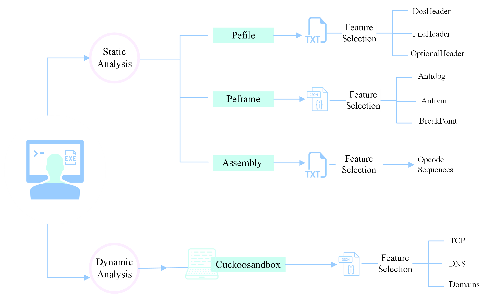

# RAT-Detection
A centralized repository for storing and sharing RAT detection Method based on BERT datasets. This repository includes structured datasets in CSV format.

**Samples sources**

1- The RAT samples were collected from MalwareBazaar.

2- The benign samples were collected from GitHub, Microsoft applications, and Softonic.

**Data Acquisition**

The Dataset acquisition is illustrated in the image below:
****
